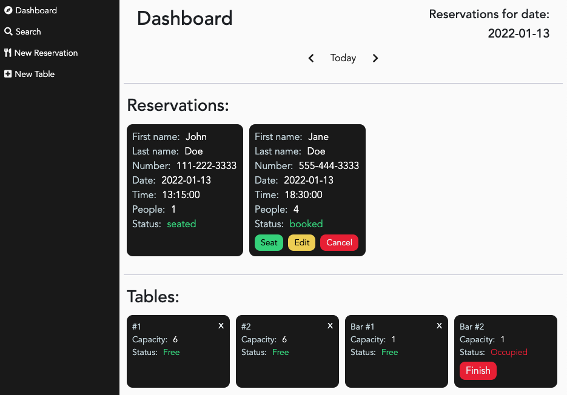
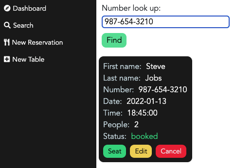
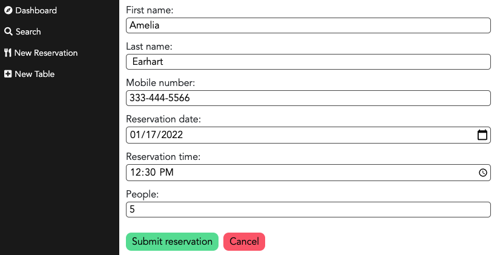
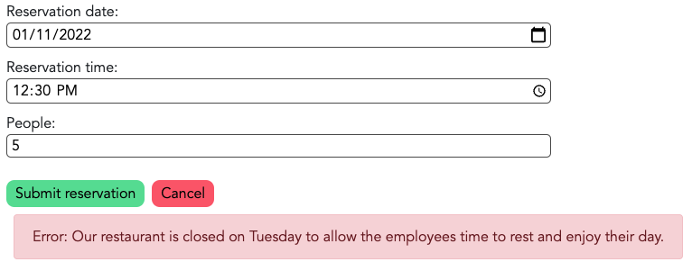
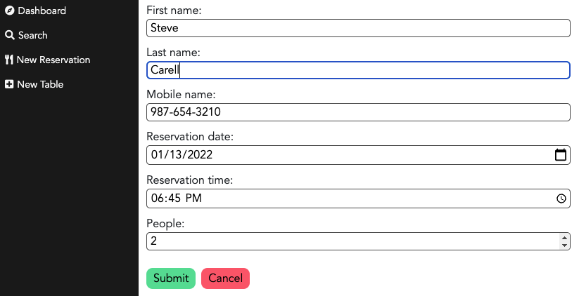
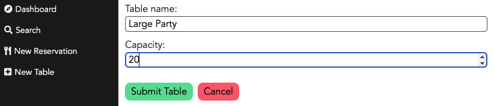
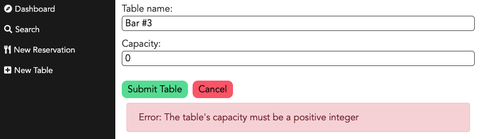
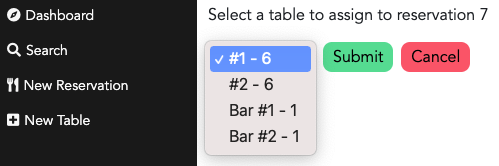
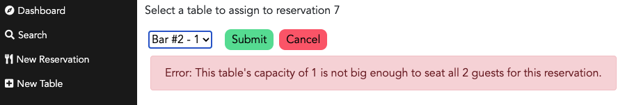
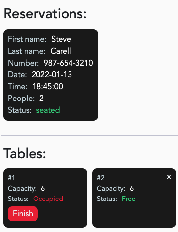

# Restaurant Reservation Application

### Table of Contents

- [Live Application](#live-application)
- [Description](#description)
- [Technologies](#technologies)
- [How To Use](#how-to-use)
- [Application Features](#application-features-(backend))
- [License](#license)
- [Author Info](#author-info)

## Live Application

This application can be viewed here: [restaurant-reservation-application.vercel.app](restaurant-reservation-application.vercel.app)

The backend API is currently running here: [restaurant-reservation-application-server.vercel.app](restaurant-reservation-application-server.vercel.app)

Both the client and server are hosted on [Vercel](https://vercel.com/) with the SQL Database hosted by [ElephantSQL](https://www.elephantsql.com/)

## Description

This application provides restaurants with having an efficient reservation booking system. The user is able to create reservations and also has the ability to edit, cancel and look-up or search for reservations by phone number. Tables of different capacities can also be created, deleted, and assigned to reservations. 

## Technologies

- Backend API setup
- Creating RESTful APIs
- Using Express for middleware request and response handling
- Implementing PostgreSQL servers
- Using Knex.js to configure migrations
- Building and mapping CRUDL operations between Knex.js and SQL commands
- Backend error tracing with morgan package (commented out in place of pinoHttp)
- Backend error tracing with pinoHttp package
- Frontend built on React with React router
- Added layer of security with Express CORS package
- Project deployment through Vercel

## How To Use

#### Installation:

1. Fork and clone this repository
2. `cd` into the newly created directory
3. Run `npm install` to install project dependencies
4. Run `npm start` to start your server

Running `npm start` will run both the backend and the client.

## API Paths

| API Path | Function |
| -------- | -------- |
| `/reservations` | GET: retrieve all reservations; POST: create a new reservation |
| `/reservations?date=YYYY-MM-DD` | GET: retrieve reservations for a specified date |
| `/reservations?mobile_number=XXX-XXX-XXXX` | GET: retrieve specific reservation containing a specified `mobile_number` |
| `/reservations?reservation_id=X` | GET: retrieve specific reservation with `reservation_id` of `X` |
| `/reservations/:reservationId` | GET: retrieve specific reservation corresponding to `reservation_id`; PUT: edit reservation with corresponding `reservation_id` |
| `/reservations/:reservationId/status` | PUT: update the status of reservation corresponding to `reservation_id` |
| `/tables` | GET: retrieve all tables; POST: create a new table |
| `/tables/:table_id` | GET: retrieve specific table containing specified `table_id`; DELETE: delete specific table containing specified `table_id` |
| `/tables/:table_id/seat` | PUT: update table upon seat assignment by assigning value of reservation_id; DELETE: update table after table is finished by clearing reservation_id |

## Application Features

The application contains a navigation menu containing 4 different pages:

- Dashboard - displays reservations and tables
- Search page
- Create new reservation
- Create new table

### Dashboard

The dashboard contains all tables as well as all reservations of a specified date (defaulted to current date). Arrows buttons are available to view reservations of the following or previous day(s). Clicking the "Today" button will return the date to the current date. 

Reservations may also contain buttons on seat assignment, editting, and cancellation. The seat button will direct the user to the seat assignment page. The edit button will direct the user to the edit page. The cancel button allows the user to cancel the reservation and remove from view.

Tables that are unoccupied contain an "x" button on the top right that will delete the table. An occupied table cannot be deleted until it is finished.

;

### Search Page

The search page allows the user to search for a reservation by phone number. Upon finding the correct reservation, the user can choose to seat the reservation, edit the reservation, or cancel it. Reservations that have already finished or have been cancelled will also be retrieved by this search. This feature creates an optimized and very efficient experience for the user when a customer calls in to alter or cancel their reservation.

### Create Reservation Page

This page includes a form element with required inputs for all reservations. Each submission also includes multiple validators on both the front-end and back-end to ensure a valid reservation is created.

A successful submission will redirect the user to the `/dashboard?date=YYYY-MM-DD` page, which displays all reservations corresponding to the `reservation_date` of the reservation that was just created. The "Today" button can be clicked to return to the current date. The cancel button will return the user to the previous page.

## Edit Reservation

Clicking the "Edit" button found on reservations leads the user to the edit reservation page. Any and all fields can be editted, but upon submission, front-end and back-end validation will check for validity of the updated reservation and provide any submission errors if any. 

Just like the reservation creation page, upon submission, the user will be redirected to `/dashboard?date=YYYY-MM-DD` corresponding to the `reservation_date` of the editted reservation. The cancel button returns the user to the previous page.

## Table Creation

This page contains a form that allows the user to create a new table. Both front-end and back-end validation check to ensure that the table name and capacity contain valid inputs.

A successful submission directs the user to the dashboard page, default to the present date. The cancel button will direct the user to the previous page.

## Seat Assignment

Clicking the "Seat" button found on reservations leads the user to the seat assignment page. A selector displays table options with each table's corresponding name followed by capacity. Upon submission both front-end and back-end validation check if the selected table's capacity can seat the reservation's size. 

The submit button directs the user to the dashboard, defaulted to the current date. The cancel button directs the user to the previous page.

The status of a reservation changes to "seated" when it has been assigned to a table. The status of the corresponding table will change to "occupied". The "Seat", "Edit", and "Cancel" buttons will no longer display on a seated reservation. A "Finish" button will now appear on an occupied table. Finishing the table will return the status of the table to "Free" and the seated reservation will disappear from view.

## License

MIT License

Copyright (c) [2021] [Miki Saarna]

Permission is hereby granted, free of charge, to any person obtaining a copy
of this software and associated documentation files (the "Software"), to deal
in the Software without restriction, including without limitation the rights
to use, copy, modify, merge, publish, distribute, sublicense, and/or sell
copies of the Software, and to permit persons to whom the Software is
furnished to do so, subject to the following conditions:

The above copyright notice and this permission notice shall be included in all
copies or substantial portions of the Software.

THE SOFTWARE IS PROVIDED "AS IS", WITHOUT WARRANTY OF ANY KIND, EXPRESS OR
IMPLIED, INCLUDING BUT NOT LIMITED TO THE WARRANTIES OF MERCHANTABILITY,
FITNESS FOR A PARTICULAR PURPOSE AND NONINFRINGEMENT. IN NO EVENT SHALL THE
AUTHORS OR COPYRIGHT HOLDERS BE LIABLE FOR ANY CLAIM, DAMAGES OR OTHER
LIABILITY, WHETHER IN AN ACTION OF CONTRACT, TORT OR OTHERWISE, ARISING FROM,
OUT OF OR IN CONNECTION WITH THE SOFTWARE OR THE USE OR OTHER DEALINGS IN THE
SOFTWARE.

## Author Info

- GitHub: [miki-saarna](https://github.com/miki-saarna)
- LinkedIn: [Mikito Saarna](https://www.linkedin.com/in/mikito-saarna/)
- Website: [MikiSaarna.com](https://MikiSaarna.com)

[Back To The Top](#theaters-movie-selection-full-stack)